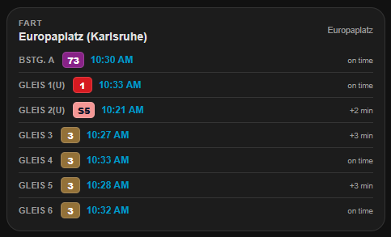

Diese Custom Component inklusive Karte zeigt die Abfahrtszeiten der
Karlsruher KVV an. Inspiriert von https://github.com/demartinomarco/F.A.R.T.,
daher der Name.

## Installation über HACS

1. In HACS dieses Repository als benutzerdefiniertes Repository hinzufügen (Kategorie: Integration).
2. Über HACS installieren.
3. Home Assistant neu starten.
4. Einstellungen -> Geräte & Dienste.
5. `Integration hinzufügen` klicken und `FART` auswählen.
6. Die Haltestelle aus der Liste auswählen.
7. Es erscheint eine Benachrichtigung mit den Einrichtungsschritten: `/fart_files/fart-ha-card.js` als Dashboard-Ressource hinzufügen (einmalig, auch bei mehreren Haltestellen nur einmal nötig) und das genaue Karten-YAML (inklusive der Entity-ID der Haltestelle) in ein Dashboard einfügen.

Die Ressource muss nur einmal hinzugefügt werden:

1. Einstellungen -> Dashboards -> das ⋮-Menü (oben rechts) -> Ressourcen.
2. Ressource hinzufügen -> URL `/fart_files/fart-ha-card.js` -> Ressourcentyp `JavaScript-Modul` -> Erstellen.

(Falls `Ressourcen` nicht in diesem Menü erscheint, im Benutzerprofil den `Erweiterten Modus` aktivieren.)
